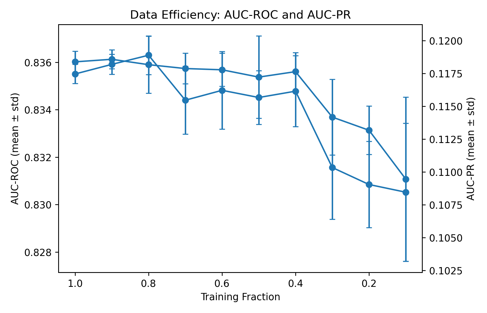
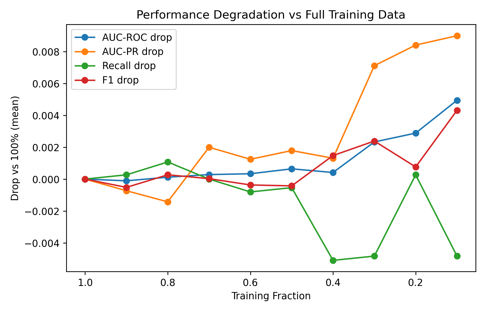
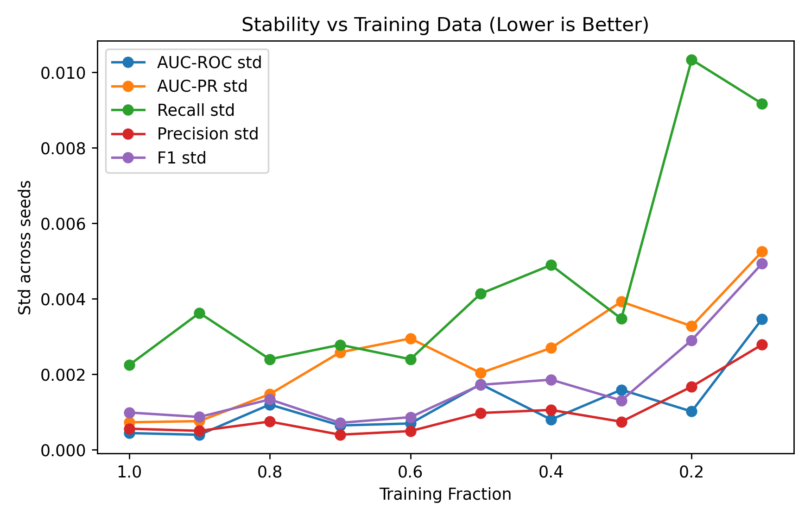
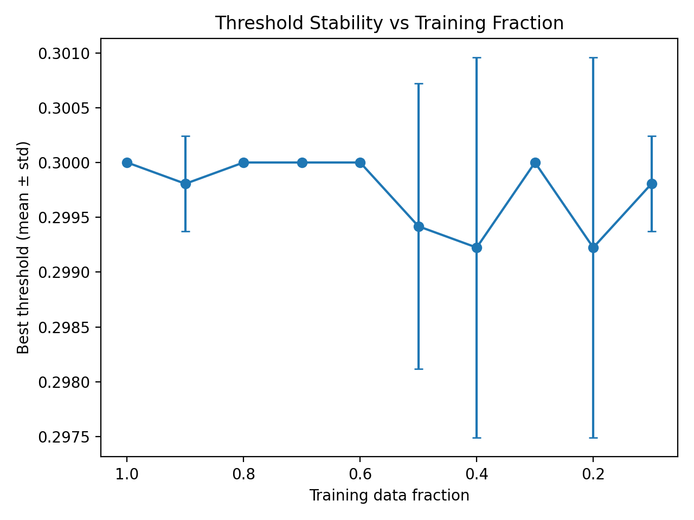

# 🫁 Lung Cancer Risk Prediction

## Data Efficiency & Stability Analysis of a Super-Stacking Ensemble

---

## 📌 Project Summary

This project evaluates the **data efficiency, robustness, and stability** of a **Super-Stacking Ensemble** model for **lung cancer risk prediction** using **15 clinically interpretable variables** derived from the PLCO dataset.

Rather than only reporting peak performance, this study answers a deeper question:

> **How much training data does the model actually need to perform well?**

To answer this, the model is trained on **progressively smaller fractions of the training data (100% → 10%)**, while keeping the **test set fixed**, allowing a clean and fair evaluation of generalization behavior.

---

## 🧠 Model Architecture

The model is a **Super-Stacking Ensemble** consisting of:

**Base learners**

* Logistic Regression
* Random Forest
* Gradient Boosting
* XGBoost
* LightGBM
* CatBoost

**Meta-learner**

* Logistic Regression (probability stacking)

**Key design choices**

* Strong regularization across models
* Class imbalance handled using `class_weight` and `scale_pos_weight`
* Decision threshold **optimized on validation set only** (F1-maximization)
* Test set remains **frozen throughout the experiment**

---

## 🧪 Experimental Design

| Component          | Description                               |
| ------------------ | ----------------------------------------- |
| Dataset            | Lung cancer classification (15 variables) |
| Test split         | 20% (stratified, fixed once)              |
| Training fractions | 1.0 → 0.1                                 |
| Random seeds       | 5 per fraction                            |
| Threshold tuning   | Validation set only                       |
| Metrics            | AUC-ROC, AUC-PR, Recall, Precision, F1    |
| Reporting          | Mean ± standard deviation                 |

This design ensures:

* No data leakage
* No optimistic bias
* Reliable stability analysis

---

## 📊 Main Results (Full Table)

**Test-set performance (mean ± std across 5 seeds)**

| Training Fraction | Runs | AUC-ROC         | AUC-PR          | Recall          | Precision       | F1              |
| ----------------- | ---- | --------------- | --------------- | --------------- | --------------- | --------------- |
| 1.0               | 5    | 0.8360 ± 0.0004 | 0.1175 ± 0.0007 | 0.8760 ± 0.0022 | 0.0545 ± 0.0006 | 0.1025 ± 0.0010 |
| 0.9               | 5    | 0.8361 ± 0.0004 | 0.1182 ± 0.0008 | 0.8757 ± 0.0036 | 0.0548 ± 0.0005 | 0.1031 ± 0.0009 |
| 0.8               | 5    | 0.8359 ± 0.0012 | 0.1189 ± 0.0015 | 0.8749 ± 0.0024 | 0.0543 ± 0.0007 | 0.1023 ± 0.0013 |
| 0.7               | 5    | 0.8357 ± 0.0006 | 0.1155 ± 0.0026 | 0.8760 ± 0.0028 | 0.0544 ± 0.0004 | 0.1025 ± 0.0007 |
| 0.6               | 5    | 0.8357 ± 0.0007 | 0.1162 ± 0.0030 | 0.8768 ± 0.0024 | 0.0547 ± 0.0005 | 0.1029 ± 0.0009 |
| 0.5               | 5    | 0.8354 ± 0.0017 | 0.1157 ± 0.0020 | 0.8765 ± 0.0041 | 0.0547 ± 0.0010 | 0.1030 ± 0.0017 |
| 0.4               | 5    | 0.8356 ± 0.0008 | 0.1161 ± 0.0027 | 0.8811 ± 0.0049 | 0.0536 ± 0.0011 | 0.1011 ± 0.0019 |
| 0.3               | 5    | 0.8337 ± 0.0016 | 0.1103 ± 0.0039 | 0.8808 ± 0.0035 | 0.0531 ± 0.0007 | 0.1001 ± 0.0013 |
| 0.2               | 5    | 0.8331 ± 0.0010 | 0.1090 ± 0.0033 | 0.8757 ± 0.0103 | 0.0540 ± 0.0017 | 0.1018 ± 0.0029 |
| 0.1               | 5    | 0.8311 ± 0.0035 | 0.1085 ± 0.0053 | 0.8808 ± 0.0092 | 0.0520 ± 0.0028 | 0.0982 ± 0.0049 |

---

## 📈 Visual Analysis

### 1️⃣ Data Efficiency (Learning Curves)

**AUC-ROC, AUC-PR, Recall, Precision, and F1 vs Training Fraction**

**Interpretation**

* Performance degrades **very gradually**
* Ranking ability (AUC-ROC) remains strong even at 10% data
* Recall remains consistently high

---

### 2️⃣ Dual-Metric Efficiency (AUC-ROC & AUC-PR)

**Interpretation**

* Ranking quality remains stable
* Precision-recall degrades smoothly, as expected for rare outcomes

---

### 3️⃣ Performance Degradation vs Full Data

**Interpretation**

* Only ~0.005 AUC-ROC loss at 10% data
* Indicates strong data efficiency
* No signs of overfitting

---

### 4️⃣ Stability Analysis (Lower Is Better)

**Interpretation**

* Variance increases gradually as data decreases
* No instability or metric collapse
* Ensemble remains reliable under data scarcity

---

### 5️⃣ Threshold Stability

**Interpretation**

* Optimal decision threshold remains near ~0.30
* Indicates stable decision boundaries
* Strong evidence against overfitting

---

## 🧠 Key Takeaways (Plain Language)

* The model **does not rely on huge amounts of data** to perform well
* Performance stays strong even with **90% less training data**
* The ensemble learns **robust, general patterns**
* Decision behavior (threshold) is **stable and predictable**
* This is exactly what you want in a **real-world screening model**

---

## 🧰 Tech Stack

* Python
* scikit-learn
* XGBoost
* LightGBM
* CatBoost
* pandas, NumPy
* Matplotlib

---

## 🚀 Why This Project Matters

Most ML projects only report peak performance.
This project goes further by answering:

> *“How reliable is the model when data is limited?”*

That question matters deeply in:

* Healthcare
* Screening systems
* Real-world deployment

---

If you want, next we can:

